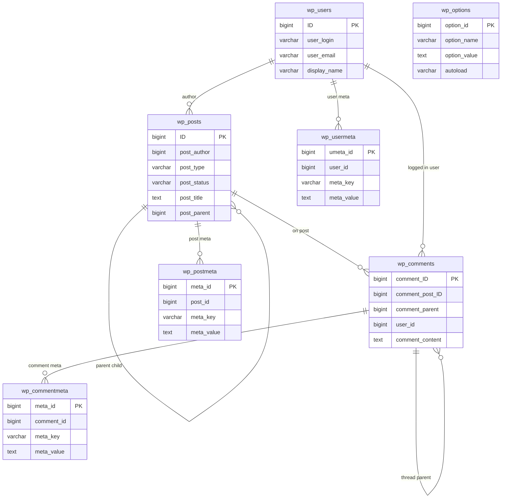

# blog_db — Core content and metadata ERD

Subset of the WordPress schema: posts, users, comments, and key–value metadata tables (`wp_postmeta`, `wp_commentmeta`, `wp_usermeta`, `wp_options`). Excludes taxonomy, links, and Action Scheduler (see [ERD.md](./ERD.md) for the full `blog_db` diagram).

View in VS Code (Markdown Preview Mermaid Support extension) or paste the block into https://mermaid.live

---

## Core tables and metadata relationships

_Logical relationships only; MySQL may not declare `FOREIGN KEY` constraints. `wp_options` is site-wide configuration and has no foreign key to posts._

