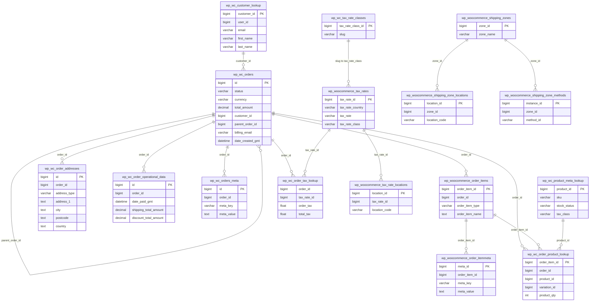

# ecommerce_db — Transactional order flow and relational decomposition ERD

Subset of the WooCommerce (HPOS-style) schema focused on **orders**, **line items**, **customer**, **product linkage**, **tax**, and **shipping zones**. Excludes analytics (`wp_wc_order_stats`), coupons-only lookups, admin notes, downloads, payment tokens, sessions, webhooks, and logging (see [ERD.md](./ERD.md) for the full `ecommerce_db` diagram).

View in VS Code (Markdown Preview Mermaid Support extension) or paste the block into https://mermaid.live

---

## Transactional tables and key relationships

_Logical relationships as in WooCommerce; MySQL may not declare every `FOREIGN KEY`. `wp_woocommerce_order_itemmeta` and `wp_wc_orders_meta` retain key–value rows alongside normalized order tables._

