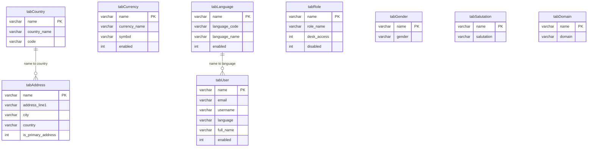

# erp_db — Reference tables and domain separation ERD

Subset of the ERPNext / Frappe schema focused on **reference Doctypes** (each in its own `tab*` table with string `name` as primary key) and a minimal illustration of **cross-domain links** (`tabLanguage` → `tabUser`, `tabCountry` → `tabAddress`). `tabRole` is shown as an isolated reference table: assigning roles to users is done via link/child Doctypes in full ERPNext and does not appear as a foreign key in this exported table set. Excludes contacts, files, comments, todos, versions, tags, notifications, blogger, and newsletter tables (see [ERD.md](./ERD.md) for the full `erp_db` diagram).

View in VS Code (Markdown Preview Mermaid Support extension) or paste the block into https://mermaid.live

---

## Independent reference tables and key relationships

_Referential integrity is enforced in Frappe/ERPNext (DocType layer), not as MySQL `FOREIGN KEY` constraints. Reference tables are not linked to one another at the storage level; edges below are logical application references only._

