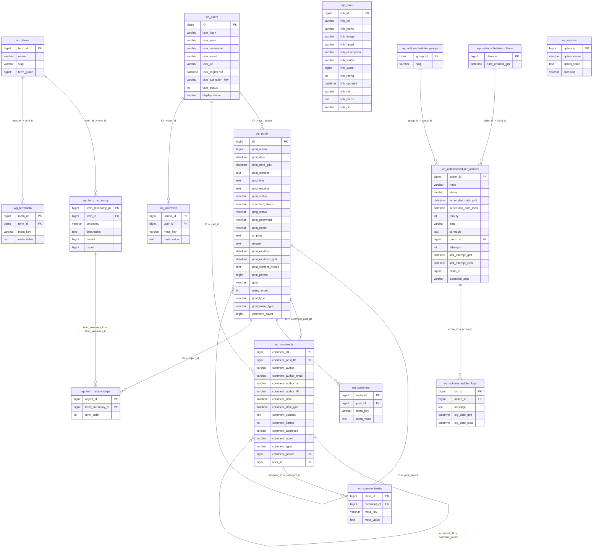
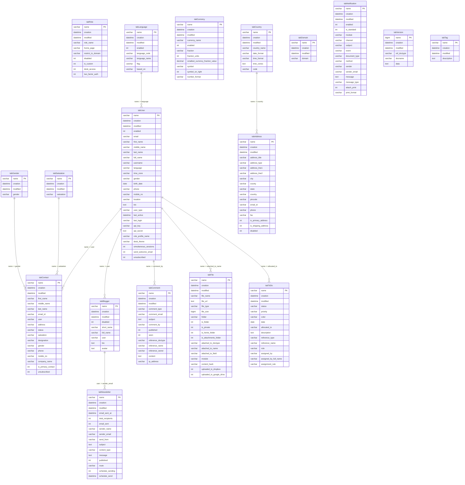

# Database ERDs

Generated from live MySQL source databases.

View in VS Code (Markdown Preview Mermaid Support extension) or paste any block into https://mermaid.live

---

## WordPress Core (blog_db)

_WordPress — posts, users, comments, terms, metadata and action scheduler_  
_16 entities · 15 relationships_

---

## WooCommerce (ecommerce_db) — all 34 tables

_Orders, analytics, shipping, tax, payments, downloads and admin_  
_34 entities · 22 relationships_

```mermaid
erDiagram
    wp_wc_orders {
        bigint id PK
        varchar status
        varchar currency
        varchar type
        decimal tax_amount
        decimal total_amount
        bigint customer_id
        varchar billing_email
        datetime date_created_gmt
        datetime date_updated_gmt
        bigint parent_order_id
        varchar payment_method
        text payment_method_title
        varchar transaction_id
        varchar ip_address
        text user_agent
        text customer_note
    }
    wp_woocommerce_order_items {
        bigint order_item_id PK
        text order_item_name
        varchar order_item_type
        bigint order_id FK
    }
    wp_woocommerce_order_itemmeta {
        bigint meta_id PK
        bigint order_item_id FK
        varchar meta_key
        text meta_value
    }
    wp_wc_order_addresses {
        bigint id PK
        bigint order_id FK
        varchar address_type
        text first_name
        text last_name
        text company
        text address_1
        text address_2
        text city
        text state
        text postcode
        text country
        varchar email
        varchar phone
    }
    wp_wc_order_operational_data {
        bigint id PK
        bigint order_id FK
        varchar created_via
        varchar woocommerce_version
        int prices_include_tax
        varchar cart_hash
        varchar order_key
        datetime date_paid_gmt
        datetime date_completed_gmt
        decimal shipping_tax_amount
        decimal shipping_total_amount
        decimal discount_tax_amount
        decimal discount_total_amount
    }
    wp_wc_orders_meta {
        bigint id PK
        bigint order_id FK
        varchar meta_key
        text meta_value
    }
    wp_wc_customer_lookup {
        bigint customer_id PK
        bigint user_id
        varchar username
        varchar first_name
        varchar last_name
        varchar email
        timestamp date_last_active
        timestamp date_registered
        char country
        varchar postcode
        varchar city
        varchar state
    }
    wp_wc_order_stats {
        bigint order_id PK
        bigint parent_id
        datetime date_created
        datetime date_created_gmt
        datetime date_paid
        datetime date_completed
        int num_items_sold
        float total_sales
        float tax_total
        float shipping_total
        float net_total
        int returning_customer
        varchar status
        bigint customer_id
    }
    wp_wc_order_product_lookup {
        bigint order_item_id PK
        bigint order_id FK
        bigint product_id
        bigint variation_id
        bigint customer_id
        datetime date_created
        int product_qty
        float product_net_revenue
        float product_gross_revenue
        float coupon_amount
        float tax_amount
        float shipping_amount
        float shipping_tax_amount
    }
    wp_wc_order_coupon_lookup {
        bigint order_id FK
        bigint coupon_id
        datetime date_created
        float discount_amount
    }
    wp_wc_order_tax_lookup {
        bigint order_id FK
        bigint tax_rate_id
        datetime date_created
        float shipping_tax
        float order_tax
        float total_tax
    }
    wp_wc_product_meta_lookup {
        bigint product_id PK
        varchar sku
        varchar global_unique_id
        int virtual
        int downloadable
        decimal min_price
        decimal max_price
        int onsale
        float stock_quantity
        varchar stock_status
        bigint rating_count
        decimal average_rating
        bigint total_sales
        varchar tax_status
        varchar tax_class
    }
    wp_wc_product_attributes_lookup {
        bigint product_id
        bigint product_or_parent_id
        varchar taxonomy
        bigint term_id
        int is_variation_attribute
        int in_stock
    }
    wp_wc_category_lookup {
        bigint category_tree_id PK
        bigint category_id
    }
    wp_woocommerce_shipping_zones {
        bigint zone_id PK
        varchar zone_name
        bigint zone_order
    }
    wp_woocommerce_shipping_zone_locations {
        bigint location_id PK
        bigint zone_id FK
        varchar location_code
        varchar location_type
    }
    wp_woocommerce_shipping_zone_methods {
        bigint instance_id PK
        bigint zone_id FK
        varchar method_id
        bigint method_order
        int is_enabled
    }
    wp_woocommerce_tax_rates {
        bigint tax_rate_id PK
        varchar tax_rate_country
        varchar tax_rate_state
        varchar tax_rate
        varchar tax_rate_name
        bigint tax_rate_priority
        int tax_rate_compound
        int tax_rate_shipping
        bigint tax_rate_order
        varchar tax_rate_class
    }
    wp_woocommerce_tax_rate_locations {
        bigint location_id PK
        varchar location_code
        bigint tax_rate_id FK
        varchar location_type
    }
    wp_wc_tax_rate_classes {
        bigint tax_rate_class_id PK
        varchar name
        varchar slug
    }
    wp_woocommerce_payment_tokens {
        bigint token_id PK
        varchar gateway_id
        text token
        bigint user_id
        varchar type
        int is_default
    }
    wp_woocommerce_payment_tokenmeta {
        bigint meta_id PK
        bigint payment_token_id FK
        varchar meta_key
        text meta_value
    }
    wp_woocommerce_downloadable_product_permissions {
        bigint permission_id PK
        varchar download_id
        bigint product_id
        bigint order_id
        varchar order_key
        varchar user_email
        bigint user_id
        varchar downloads_remaining
        datetime access_granted
        datetime access_expires
        bigint download_count
    }
    wp_wc_download_log {
        bigint download_log_id PK
        datetime timestamp
        bigint permission_id FK
        bigint user_id
        varchar user_ip_address
    }
    wp_wc_product_download_directories {
        bigint url_id PK
        varchar url
        int enabled
    }
    wp_wc_admin_notes {
        bigint note_id PK
        varchar name
        varchar type
        varchar locale
        text title
        text content
        varchar status
        varchar source
        datetime date_created
        datetime date_reminder
        int is_snoozable
        varchar layout
        varchar image
        int is_deleted
        int is_read
        varchar icon
    }
    wp_wc_admin_note_actions {
        bigint action_id PK
        bigint note_id FK
        varchar name
        varchar label
        text query
        varchar status
        varchar actioned_text
        varchar nonce_action
        varchar nonce_name
    }
    wp_woocommerce_api_keys {
        bigint key_id PK
        bigint user_id
        varchar description
        varchar permissions
        char consumer_key
        char consumer_secret
        char truncated_key
        datetime last_access
    }
    wp_wc_webhooks {
        bigint webhook_id PK
        varchar status
        text name
        bigint user_id
        text delivery_url
        varchar topic
        datetime date_created_gmt
        datetime date_modified_gmt
        int api_version
        int failure_count
        int pending_delivery
    }
    wp_woocommerce_sessions {
        bigint session_id PK
        char session_key
        text session_value
        bigint session_expiry
    }
    wp_woocommerce_attribute_taxonomies {
        bigint attribute_id PK
        varchar attribute_name
        varchar attribute_label
        varchar attribute_type
        varchar attribute_orderby
        int attribute_public
    }
    wp_woocommerce_log {
        bigint log_id PK
        datetime timestamp
        int level
        varchar source
        text message
        text context
    }
    wp_wc_rate_limits {
        bigint rate_limit_id PK
        varchar rate_limit_key
        bigint rate_limit_expiry
        int rate_limit_remaining
    }
    wp_wc_customer_lookup ||--o{ wp_wc_orders : "customer_id -> customer_id"
    wp_wc_orders ||--o{ wp_wc_order_stats : "id -> order_id"
    wp_wc_orders ||--o{ wp_woocommerce_order_items : "id -> order_id"
    wp_woocommerce_order_items ||--o{ wp_woocommerce_order_itemmeta : "order_item_id -> order_item_id"
    wp_wc_orders ||--o{ wp_wc_order_addresses : "id -> order_id"
    wp_wc_orders ||--o{ wp_wc_order_operational_data : "id -> order_id"
    wp_wc_orders ||--o{ wp_wc_orders_meta : "id -> order_id"
    wp_wc_orders ||--o{ wp_wc_order_product_lookup : "id -> order_id"
    wp_wc_orders ||--o{ wp_wc_order_coupon_lookup : "id -> order_id"
    wp_wc_orders ||--o{ wp_wc_order_tax_lookup : "id -> order_id"
    wp_wc_product_meta_lookup ||--o{ wp_wc_order_product_lookup : "product_id -> product_id"
    wp_wc_product_meta_lookup ||--o{ wp_wc_product_attributes_lookup : "product_id -> product_id"
    wp_wc_tax_rate_classes ||--o{ wp_woocommerce_tax_rates : "slug -> tax_rate_class"
    wp_woocommerce_tax_rates ||--o{ wp_woocommerce_tax_rate_locations : "tax_rate_id -> tax_rate_id"
    wp_woocommerce_tax_rates ||--o{ wp_wc_order_tax_lookup : "tax_rate_id -> tax_rate_id"
    wp_woocommerce_shipping_zones ||--o{ wp_woocommerce_shipping_zone_locations : "zone_id -> zone_id"
    wp_woocommerce_shipping_zones ||--o{ wp_woocommerce_shipping_zone_methods : "zone_id -> zone_id"
    wp_woocommerce_attribute_taxonomies ||--o{ wp_wc_product_attributes_lookup : "attribute_name -> taxonomy"
    wp_woocommerce_payment_tokens ||--o{ wp_woocommerce_payment_tokenmeta : "token_id -> payment_token_id"
    wp_woocommerce_downloadable_product_permissions ||--o{ wp_wc_download_log : "permission_id -> permission_id"
    wp_woocommerce_downloadable_product_permissions ||--o{ wp_wc_product_download_directories : "product_id -> url_id"
    wp_wc_admin_notes ||--o{ wp_wc_admin_note_actions : "note_id -> note_id"
```

---

## ERPNext (erp_db) — all 18 tables

_Users, roles, contacts, reference data, content and system tables_  
_18 entities · 10 relationships · classified as **3NF** in the thesis (tabular Doctypes; referential integrity enforced in Frappe/ERPNext, not as MySQL `FOREIGN KEY` constraints)._  
_ERPNext uses string `name` as PK and application-level references (no DB-level FK constraints)._

