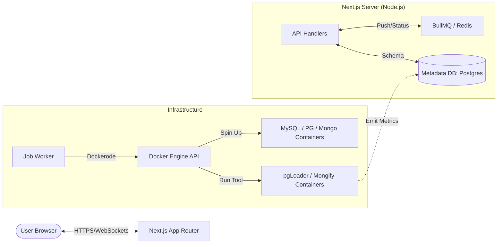

# Final Platform Architecture: "MigrateOptima"

This document defines the final full-stack architecture for the Migration Comparison Platform using the Next.js/Node.js ecosystem.

## 1. System Topology

---

## 2. Technology Stack

| Layer | Technology | Rationale |
| :--- | :--- | :--- |
| **Frontend** | Next.js 14+ (React) | SSR for SEO and fast initial load; Client components for real-time charts. |
| **Styling** | Tailwind + Shadcn/UI | Modern, responsive, and highly customizable "Science" aesthetic. |
| **Orchestration** | Node.js + `dockerode` | Direct control over your existing Docker migration containers. |
| **Messaging** | Redis + BullMQ | Reliable processing of 20s+ migrations without timing out HTTP requests. |
| **ORM** | Prisma / Drizzle | Type-safe access to job history and metrics data. |
| **Real-time** | Server-Sent Events (SSE) | Lightweight way to push row counts from the worker to the UI. |

---

## 3. The "Standard Migration" Flow

1.  **Trigger**: User uploads a SQL dump and selects "PostgreSQL".
2.  **Queue**: API creates a `Job` record (status: `PENDING`) and pushes it to BullMQ.
3.  **Spawn**: Worker picks up the job, creates a unique Docker Network, and starts the Target PostgreSQL container.
4.  **Execute**: Worker starts the `pgloader` container using our `.conf` templates.
5.  **Monitor**: A background helper polls the `pgloader` logs/metrics and updates the `Job` record.
6.  **Analyze**: Once finished, the `analyze_migration.py` logic is triggered to confirm integrity.
7.  **Display**: Dashboard updates to `SUCCESS` and shows the final throughput table.

---

## 4. Key Security & Scaling Considerations
- **Sandboxing**: Every user migration runs in a **restricted Docker network** to prevent cross-container interference.
- **Auto-Cleanup**: A cron job/hook must delete "Target Containers" after 1 hour of inactivity to save RAM.
- **Resource Limits**: Each migration container is limited to 1GB RAM to ensure host stability.
