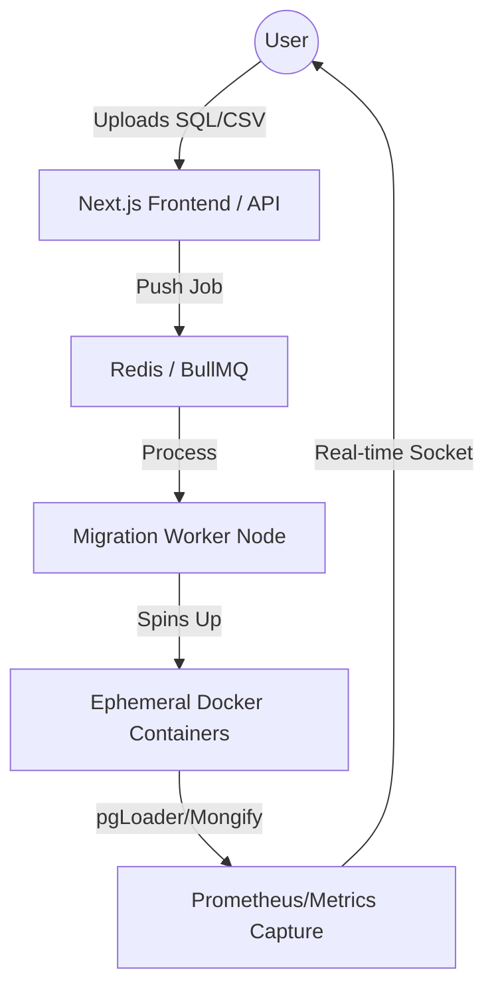

# Migration Platform Architecture: "MigrateOptima" (Next.js)

This design outlines a scalable platform where users upload datasets (SQL/CSV) and trigger real-time comparisons between migration tools.

## 1. High-Level Architecture Overview

---

## 2. Core Functional Components

### A. Frontend (Next.js + Tailwind + Lucide)
- **Dashboard**: Visual comparison of throughput (rows/sec), memory delta, and schema fidelity.
- **Real-time Logs**: Use **Server-Sent Events (SSE)** or **WebSockets** to stream Docker logs directly to the user's browser.
- **Visual Mapping Tool**: A drag-and-drop UI to define how SQL tables map to MongoDB collections (similar to MongoDB Relational Migrator).

### B. The "Comparison Engine" (Backend)
- **Job Orchestrator (Node.js/TypeScript)**: Receives the upload, saves it to a transient volume, and triggers a worker.
- **Docker Engine API**: Instead of running a static `docker-compose`, the platform uses the API to create isolated "Sandboxes" for exactly the duration of the migration.
  - *Scenario A*: Create a MySQL source container + Postgres target + pgLoader tool.
  - *Scenario B*: Create a MySQL source + MongoDB target + mongify tool.

### C. Metrics Capture
- **Sidecar Monitor**: A small script (like our `analyze_migration.py` but running as a daemon) that polls row counts every 500ms and pushes them to the frontend.
- **Resource Profiling**: Capture CPU and RAM usage of the containers during the run to provide "Cost vs. Speed" insights.

---

## 3. Tech Stack Recommendations
- **Frontend**: Next.js 14+ (App Router), Shadcn/UI for premium aesthetics.
- **Backend/Worker**: Node.js (BullMQ) or Python (Celery) to handle the long-running migration logic.
- **Storage**: 
    - **S3/Minio**: For temporary storage of uploaded SQL files.
    - **PostgreSQL**: For job history, metrics, and user preferences.
- **Infrastructure**: Docker for local development, Kubernetes (K8s) for scaling Sandboxes in production.

---

## 4. Implementation roadmap (MVP)
1.  **Step 1**: Build the Next.js upload UI and simple API that calls a Shell script (wrapping our current Docker commands).
2.  **Step 2**: Implement a basic Queue (Redis) so multiple users can run migrations without crashing the server.
3.  **Step 3**: Build the "Fidelity Checker" (enhanced version of our script) that generates the comparison table as a JSON response for the UI.
4.  **Step 4**: Add "Live Progress" by streaming container logs over WebSockets.

---

## 5. Key Advantage for Thesis
This platform moves your research from a **Static Report** to a **Dynamic Framework**. Users can test *their specific* weird data types and see instantly which tool fails or creates the best schema.
